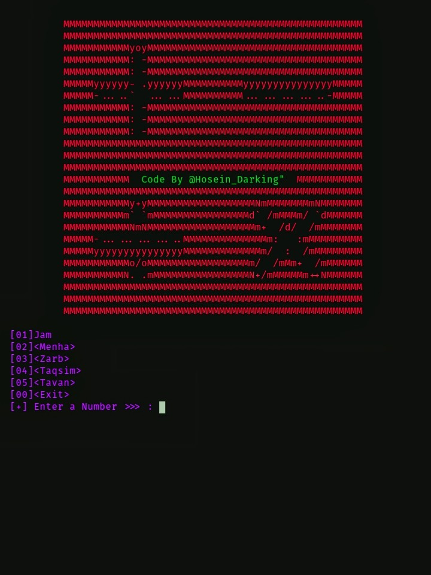

# Calculator

# prerequisites

`$ pkg install git`

`$ pip2 install colorama`

`$ pip2 install bs4`

`$ pip2 install pyfiglet`

`$ pkg install python2`

# run
`$ https://github.com/HoseinDarking/Calculator`

`$ cd Calculator`

`$ python2 calculator.py`
